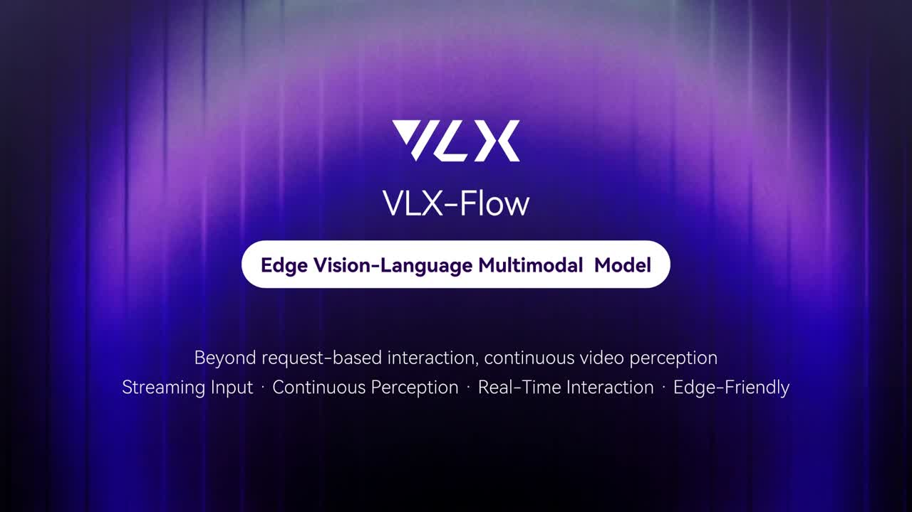
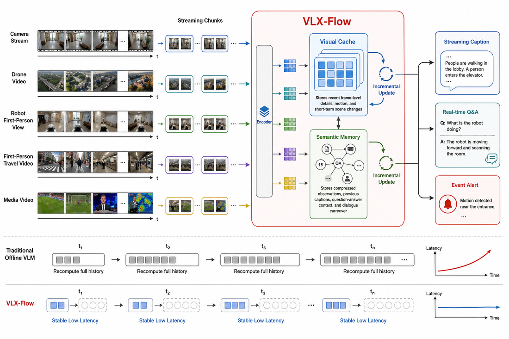
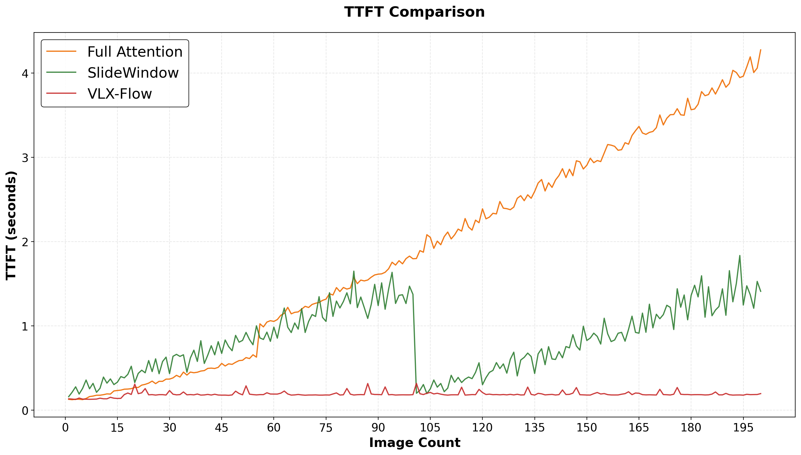

<p align="center">
  
</p>

<h1 align="center">VLX-Flow</h1>

<h3 align="center">Continuous Video Understanding for Multimodal Models</h3>

<p align="center">
  English | <a href="README_zh.md">中文</a>
</p>

<p align="center">
  <a href="https://x.com/OmAI_lab">
    
  </a>
  <a href="https://www.youtube.com/@OmAILab_global">
    
  </a>
  <a href="https://discord.gg/SEVNjyXPef">
    
  </a>
  <a href="https://om-ai-lab.github.io/2026_06_26_vlx_flow_en.html">
    
  </a>
  <a href="https://om-agent.com">
    
  </a>
  <a href="https://huggingface.co/blog/omlab/vlx-flow">
    
  </a>
</p>


<p align="center"><sub>Overview video: VLX-Flow for continuous video understanding.</sub></p>

<p align="center">
  <a href="https://www.youtube.com/watch?v=VoTLjBgCAKk">
    
  </a>
  <br>
  📺 HD version: <a href="https://www.youtube.com/watch?v=VoTLjBgCAKk">Watch on YouTube</a>
</p>

## Community

Join the VLX community to connect with developers, explore applications, share feedback, and shape the future of multimodal AI.

<table>
  <tr>
    <th align="center">Official WeChat</th>
    <th align="center">Discord Community</th>
  </tr>
  <tr>
    <td align="center">
      
    </td>
    <td align="center">
      
    </td>
  </tr>
</table>

For technical support, partnerships, and community inquiries, contact us at: **[marketing@hzlh.com](mailto:marketing@hzlh.com)**

## Overview

VLX-Flow is a streaming vision-language model that enables AI systems to continuously perceive, understand, and interact with real-time video streams. It targets scenarios where video is not a pre-recorded file to be analyzed once, but a continuous input stream from cameras, robots, drones, media feeds, or edge devices.

VLX-Flow splits the input video into continuous chunks, encodes each new chunk, and incrementally updates internal stream memory. When a user asks a question, the model can answer from this maintained memory instead of rebuilding context from the full history.

> [!TIP]
> 🚀 **Try VLX** [**here**](https://om-agent.com) and explore how it enables machines to perceive, reason, and act in real time.

<p align="center">
  
  <br>
  <sub>VLX-Flow processes streaming chunks and maintains visual cache plus semantic memory for low-latency interaction.</sub>
</p>

## Why VLX-Flow

Most video understanding VLMs rely on full-frame input or fixed sampling. These strategies are useful for offline video analysis, but they are less suitable for online settings where video keeps changing and user questions may arrive at any moment.

VLX-Flow is designed to shift video understanding from:

```text
offline video request -> full reprocessing -> answer
```

to:

```text
continuous observation -> incremental memory update -> instant interaction
```

The design focuses on:

- **Streaming-first processing:** process video chunks as they arrive instead of reprocessing the full history.
- **Internal stream memory:** maintain visual cache and semantic memory inside the model.
- **Low-latency interaction:** answer from maintained memory as streams grow.

## Core Ideas

### Streaming Input

VLX-Flow divides video into consecutive chunks. Each chunk contains a small number of frames and is processed in temporal order.

For each incoming chunk:

1. The visual encoder converts the new frames into model-readable visual features.
2. The language model consumes those features together with the current context.
3. The model updates its visual cache and semantic memory.
4. Previous history is preserved in compressed form rather than repeatedly appended as raw frames.

This avoids the two extremes of dropping old information entirely or keeping an ever-growing full-history context.

### Two-Layer Memory

VLX-Flow maintains internal stream memory through two complementary layers:

- **Visual cache:** keeps recent frame-level details for immediate interaction and event detection.
- **Semantic memory:** stores high-level context accumulated inside the model from the video stream and interactions, including streaming descriptions, prior observations, user questions, model answers, and dialogue context.

The two layers work together: the visual cache protects recent details, while semantic memory keeps the longer temporal narrative coherent.

### Cache-Aware Inference

VLX-Flow uses cache-aware execution so that new chunks can be processed incrementally. The language model includes Linear Attention components. Compared with standard self-attention, which requires a growing KV cache as sequence length increases, Linear Attention can preserve history through recurrent state and update it incrementally.

This provides two practical benefits:

- **More stable latency:** the system does not need to recompute the full history for each new interaction.
- **Smoother memory growth:** long video streams can maintain semantic continuity with lower memory pressure.

<p align="center">
  
  <br>
  <sub>Time to first token (TTFT) as the number of input images increases. Full Attention (orange) rises steadily as the historical context grows. SlideWindow (green) limits history with window resets, producing a rise-reset-rise pattern. VLX-Flow (red) compresses history through its two-layer memory mechanism, keeping TTFT low and stable over long sequences.</sub>
</p>

## Capabilities

VLX-Flow is intended to support online video understanding workflows:

- **Streaming captioning:** continuously describes incoming video while preserving temporal continuity.
- **Real-time video question answering:** answers questions while video is playing or while a camera is running.
- **Event-triggered interaction:** can be extended toward alerts when maintained state satisfies a specified event condition.

## Release

Checkpoints: Coming soon
